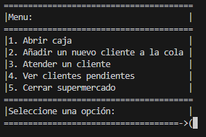
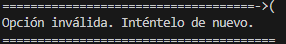
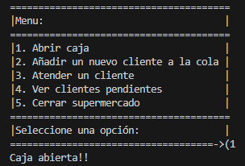
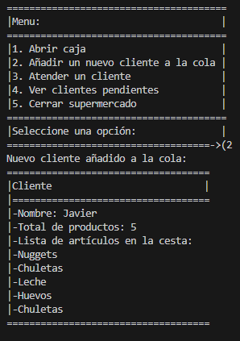
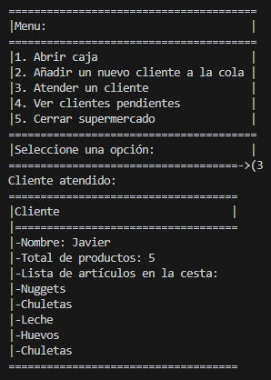
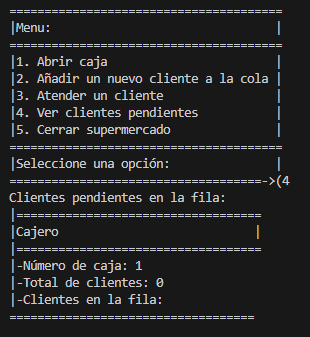
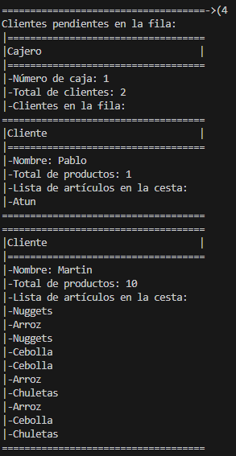
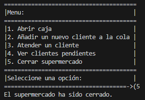

Al momento de iniciar el programa se nos mostrara un menu como el siguiente :  

Si no ingresamos ninguno valor nos saltara el siguiente mensaje : 

Al ingresar la opcion 1 la caja se abrira y nos mostrara el siguiente mensaje por pantalla :

Al ingresar la opcion 2 se añadira un nuevo cliente a la cola  y se nos mostrara la informacion del cliente en cola, siempre y cuando la caja este abierta

Al ingresar la opcion 3 se atendera un cliente y mostrara por pantalla el cliente atendido , siempre y cuando la caja este abierta

Al ingresar la opcion 4 nos mostrara el numero de caja, el total de clientes y la lista de clientes pendientes siempre y cuando la caja este abierta

la lista de clientes por atender se visualizara de la siguiennte manera :

Al ingresar la opcion 5 se cerrara el supermercado y  el programa se finalizara

Si ingresamos un valor fuera del rango aceptado por el menu nos saldra el siguiente mensaje

